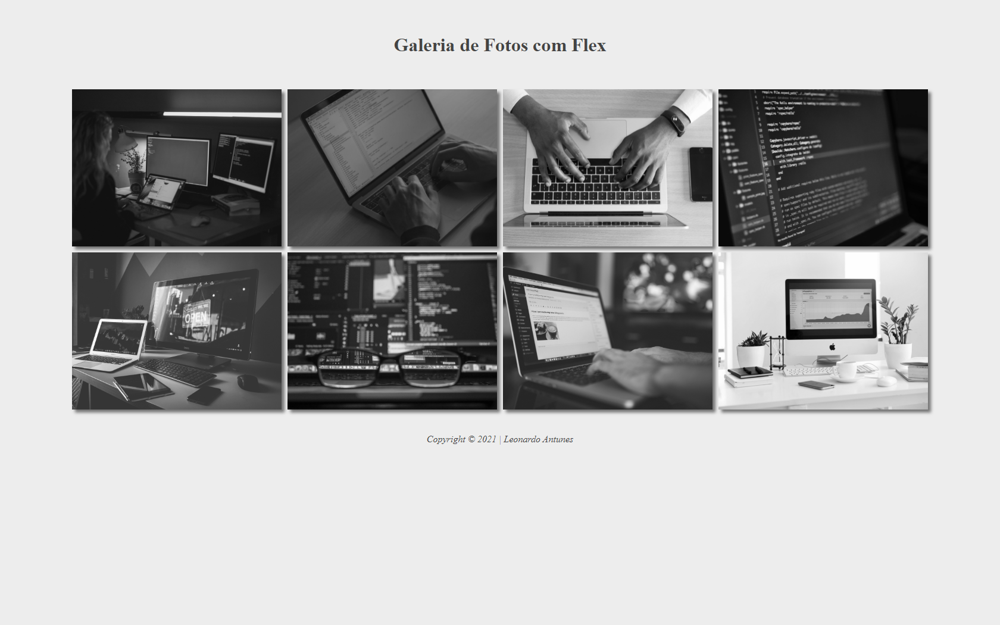

# Lima - Galeria Flex

Projeto construido durante as aulas de "lima", no <a href="https://jandira.sp.senai.br/">Senai - Jandira</a>, com o <a href="https://github.com/fernandoleonid">Prof° Leonid</a>, no curso de desenvolvimento de Sistemas.

## Qual era o objetivo do exercicio?

O objetivo do exercicio era criar uma galeria de imagens usando o flexbox do css.

## Tecnologias usadas

-   HTML 5
-   CSS 3
